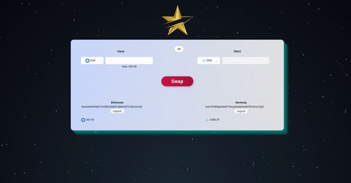
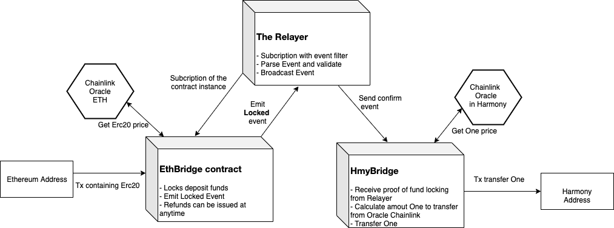

<h1 align="center">Welcome to GoldenStarSwap 👋</h1>
<p>
  
</p>

<p>
  
</p>
## Introduction

GoldenStarSwap brings the easiest way to swap crypto across blockchains. You can swap **ERC-20s**, **ETH** to **ONE (Harmony)** and vice versa.

To ensure fairness when exchanging cryptocurrencies, GoldenStarSwap uses **Chainlink Oracle** to be able to retrieve the value of the cryptocurrencies that users want to exchange 👌.

GoldenStarSwap swaps enable two parties who in know or trust each other to trade without a trusted third party. Through smart contract escrows, the GoldenStarSwap is guaranteed to either execute successfully or refund the parties involved

GoldenStarSwap is still being built to provide exchangeable protocols between cryptocurrencies, the next stage will be able to connect to **Cosmos** and **Tomochain** platforms.

## Architecture

This prototype includes functionality to safely lock and unlock ERC-20s, and transfer corresponding representative tokens on the Harmony chain.

#### EthBridge contract

First, the smart contract is deployed to an Ethereum network. A user can then send ERC-20s to that smart contract to lock up their ERC-20s and trigger the transfer flow.

The goal of the EthBridge smart contracts is to securely implement core functionality of the system such as ERC-20s locking and event emission without endangering any user funds.

The amount of tokens will be converted to USD amount through the price of the Chainlink Oracle

#### Oracle Chainlink

Oracle Chainlink is used on both Ethereum and Harmony sides to get the corresponding value of ERC-20 and One tokens during the swap. It can be said that this is the heart to a successful transaction

#### The Relayer

The Relayer is a service which interfaces with both blockchains, allowing validators to attest on blockchain that specific events on the Ethereum blockchain have occurred. Through the Relayer service, validators witness the events and submit proofs to HmyBridge

The Relayer process:

- Listen event **Locked** from EthBridge contract
- When an event is seen, parse information associated with the Ethereum transaction
- Uses this information then validate before sending this transaction to HmyBridge.

#### HmyBridge contract

HmyBridge contract is responsible for receiving and decoding transactions involving EthBridge claims and for processing the result of a successful claim.
The process:

- A transaction with a message is received
- The message is decoded and transformed into a generic
- Get the value OneUSD from the Oracle Chainlink to be able to calculate the corresponding amount of One that the user is receiving
- Transfer One

## Architecture Diagram



## Installation

Testnet version : Ropsten + Harmony testnet

#### Deploy EthBridge contract

Deploy on Ropsten testnet

- Config .env with variable:

```
ETH_OPERATOR_ADDRESS=
ETH_OPERATOR_PRIVATE_KEY=
ETH_OPERATOR_MNEMONIC=

INFURA_PROJECT_ID=
ETH_GAS_LIMIT='6721975'

```

- Deploy contract:

```
cd eth
yarn migrate
```

#### Deploy EthBridge contract

Deploy on Harmony testnet

- Config .env:

```
ETH_OPERATOR_ADDRESS='0x8f287eA4DAD62A3A626942d149509D6457c2516C'
ETH_OPERATOR_PRIVATE_KEY='b03fd86516315e3f12874ddfd4f73a1cefd7fd8f608fec3eaba6f8fbdb2fa85d'
ETH_OPERATOR_MNEMONIC="access ring phrase vapor smooth clever lens special gym lion junk brass"

HMY_OPERATOR_ONE_ADDRESS='one12j4ycvnta3l68ep28lpe73n20wx470yfzq9uf3'
HMY_OPERATOR_ADDRESS='0x54aa4C326BEc7Fa3e42A3Fc39F466A7B8D5f3C89'
HMY_OPERATOR_PRIVATE_KEY='0x9af8bba5dd5fc34e523b9e6449e1488b8ac0697731afbd646e8b100a1226c9fd'
HMY_OPERATOR_MNEMMONIC='train jump giraffe parent awkward planet limit build pistol tag grunt farm tornado option fame pill kind flat jealous unfair story sausage curious bone'

TESTNET_0_URL='https://api.s0.b.hmny.io'

INFURA_PROJECT_ID='469a0721f318401584ab3639fb548d63'
ETH_GAS_LIMIT='6721975'

ETH_USER_ADDRESS='0x02610D24fd42f1237c584b6A699727aBAE7cC04e'
ETH_USER_PRIVATE_KEY='4bbf6348fd657d6dbd5987251f2413d217f7c2601185a6343e87a7c22621d0fe'

HMY_USER_ADDRESS='0xc162199cDaeAa5a82f00651dd4536F5d2d4277C5'

```

#### Run Frontend

```js
cd client
yarn install
yarn start
```
